# Learn-Django

#### Django3 学习记录

> 安装 Django

```shell
pip3 install django==version
```

> 创建项目

```shell
django-admin startproject projectname
```

> 默认文件介绍

```shell
mysite
├── manage.py       //项目管理、启动项目、创建app、数据管理(---经常使用---)
└── mysite
    ├── __init__.py
    ├── asgi.py     //接收网络请求(不需要改)
    ├── settings.py //项目配置(---经常修改---)
    ├── urls.py     //url和函数的对应关系(---经常修改---)
    └── wsgi.py     //接收网络请求(不需要改)
```

> App

```
- 项目
    - app，用户管理
    - app，网站
    - app API
    //每个app互不影响
    //一般一个项目就创建一个app
```

> 创建 App

```shell
python3 manage.py startapp appname
```

> App 项目结构

```
app
├── __init__.py
├── admin.py          //固定不用动,Django默认提供的admin后台管理
├── apps.py           //固定不用动,app启动类
├── migrations        //固定不用动,数据库变更记录
│   └── __init__.py
├── models.py         //对数据库进行操作(重要)
├── tests.py          //固定不用动,单元测试
└── views.py          //函数(重要)
```

> 启动运行 App

- 注册 app  在setting.py中的  INSTALLED_APPS中添加  appname.apps.AppConfig   [setting.py]

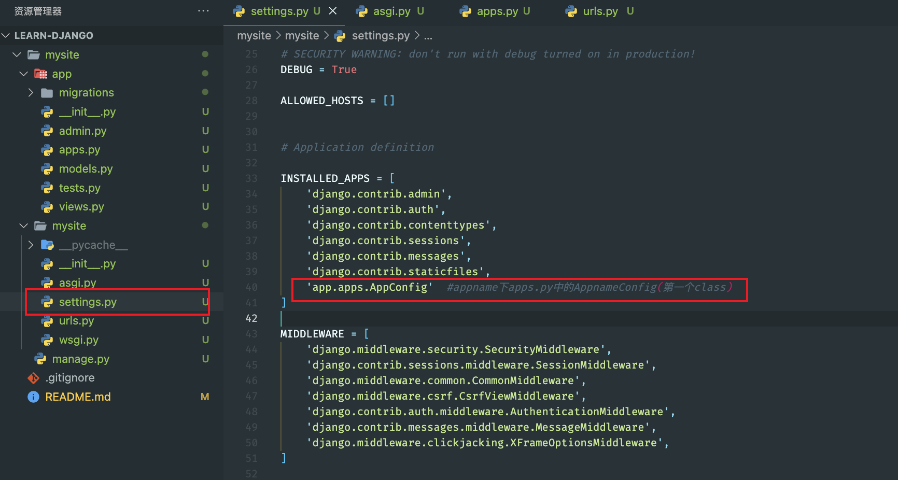

- 编写 URL 和视图函数的对应关系   [urls.py]

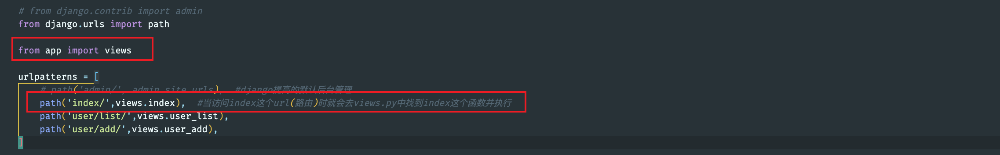

- 编写视图函数  [views.py]

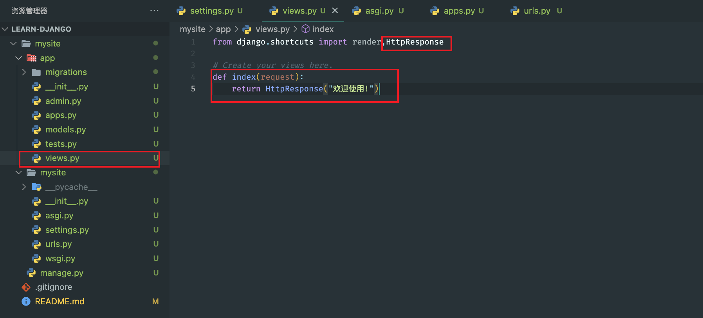

- 启动Django项目

  ```shell
  python3 manage.py runserver   然后访问http://127.0.0.1:8000/index
  ```

  

> URL与函数的对应关系

```
url->函数->执行函数
```

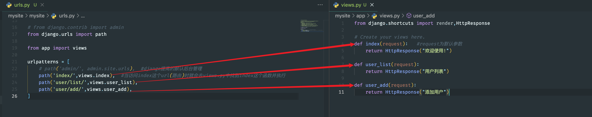

> templates模版

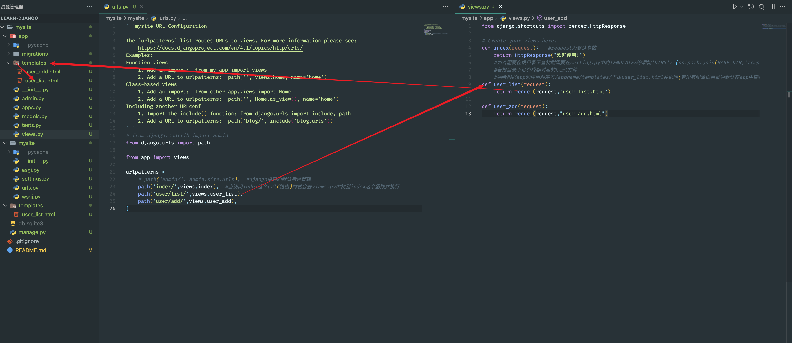

> 静态文件

**开发过程中一般将**:

- 图片
- css
- js

**都视为静态文件存放在/appname/static/下**

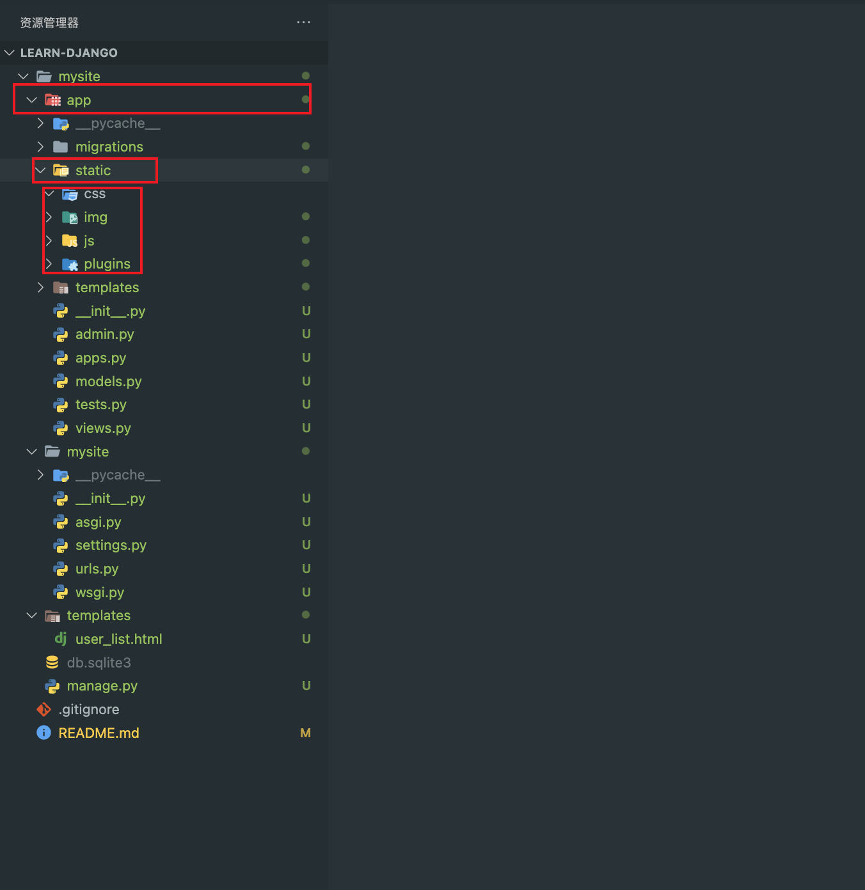

- 引用静态文件

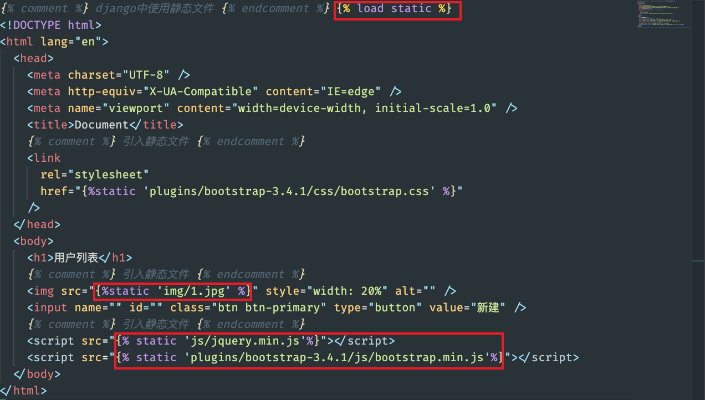

> 模版语法

*本质上:在HTML中写一些占位符,由数据对这些占位符进行替换和处理*

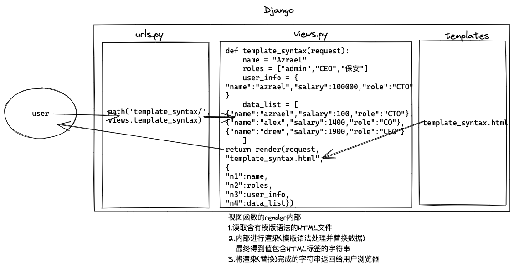

> 请求和响应

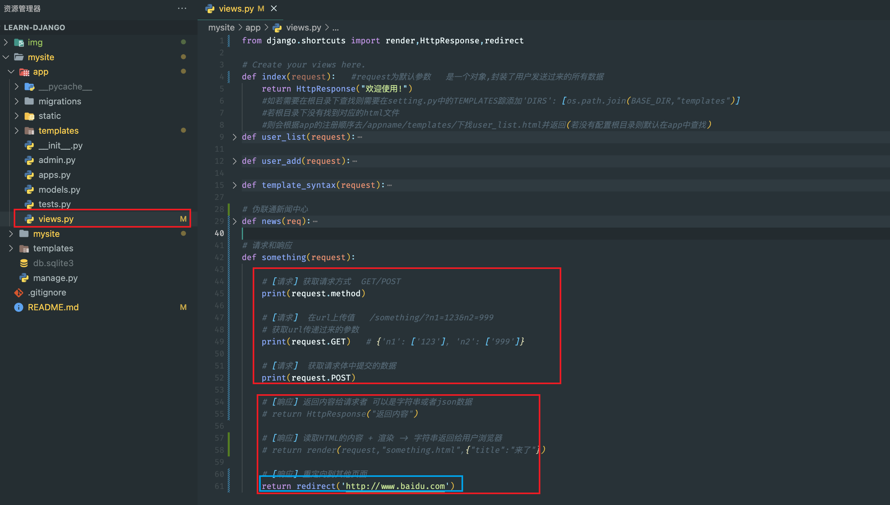

- redirect重定向工作方式如下(Django返回一个值后,浏览器再去向这个页面发起请求)

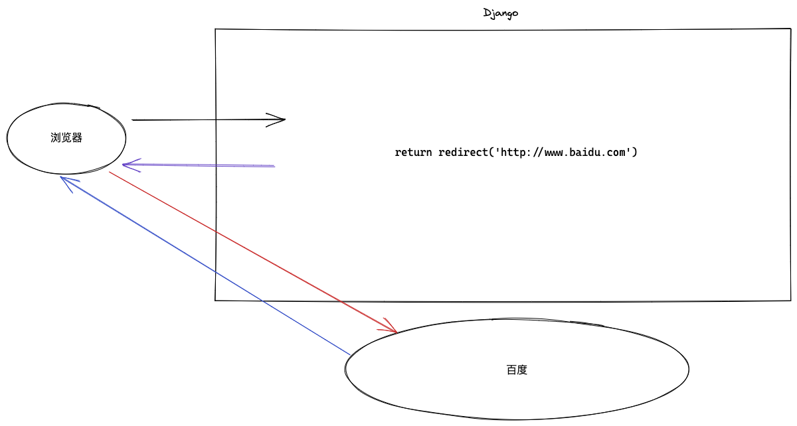

> form表单提交报错

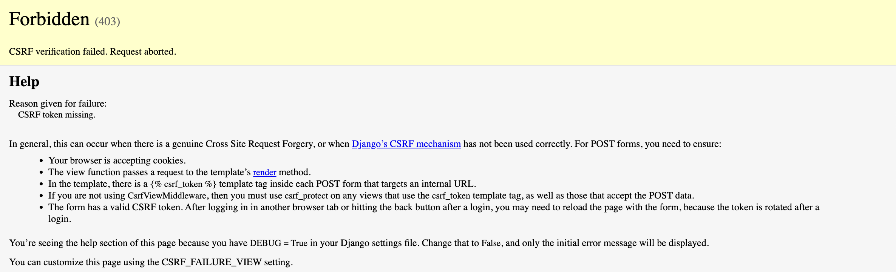

- 解决办法(在form表单内部添加     )

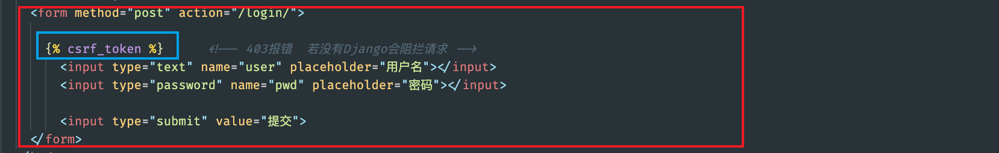

> Django使用ORM操作数据库

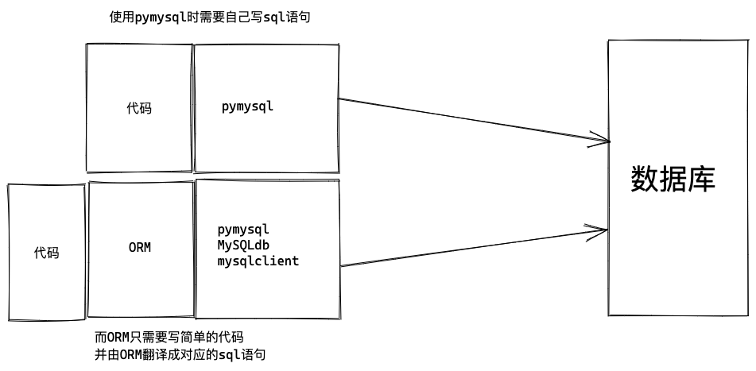

- 安装第三方模块

```shell
pip3 install mysqlclient
```

> ORM

- 创建、修改、删除数据库中的表(不用写SQL语句);[无法创建数据库]
- 操作表中的数据(不用写SQL语句)

> Django连接数据库

- 在setting.py中进行配置和修改

> Django操作表(在models.py中)

- 创建表

```python
class UserInfo(models.Model):
    name = models.CharField(max_length=32)
    password = models.CharField(max_length=64)
    age = models.IntegerField()
    
    
  """ 
上述代码等同于
create table appname_classname[小写的类名](
    id bigint auto_increment primary key,   此行为自动生成
    name varchar(32),
    password varchar(64),
    age int
)
"""
 

# 在此之前app必须注册
# setting.py  INSTALLED_APPS中添加      'app.apps.AppConfig'  #appname下apps.py中的AppnameConfig(第一个class)


python3 manage.py makemigrations  # 检查是否更改

python3 manage.py migrate         # 应用更改
```


- 删除表

*删除相应的class 再执行上述命令*  

- 修改表

在表中新增列时,由于已存在的的列中可能已有数据，所以新增的列必须要指定数据

- ​	

  - 手动添加

  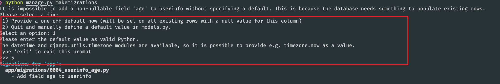

  - 设置默认值 

  ```python
  size = models.IntegerField(default=5)
  ```

  - 允许为空

  ```python
  data = models.IntegerField(null=True,blank=True) 
  ```

> Django操作表中的数据

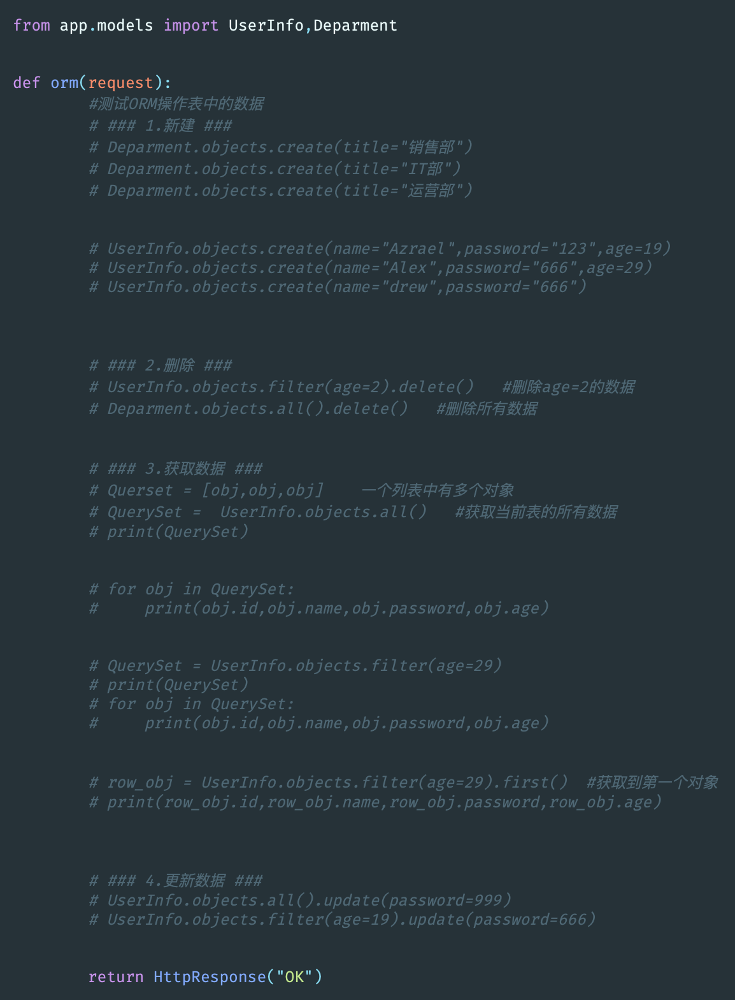
