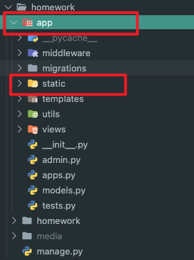
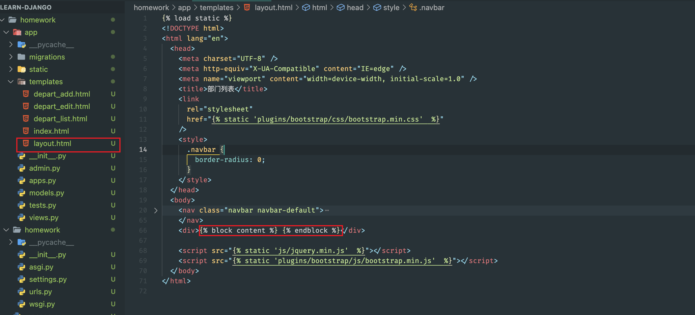
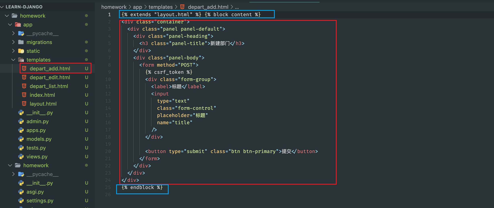
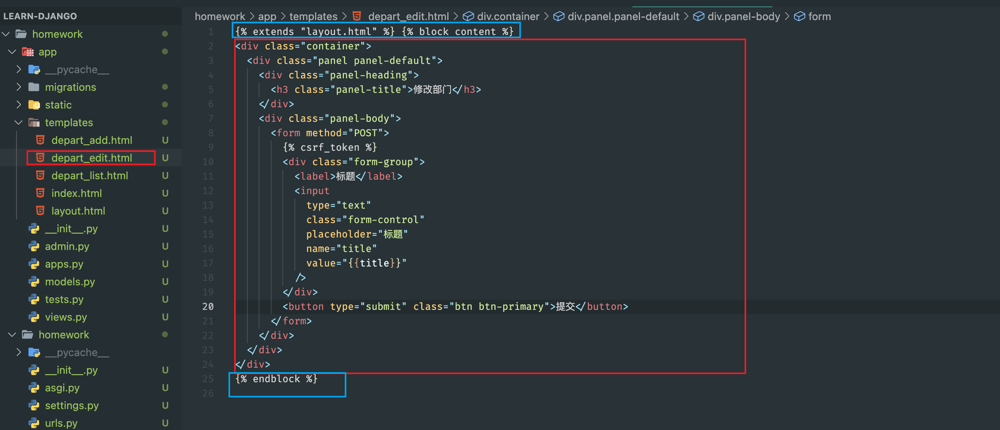
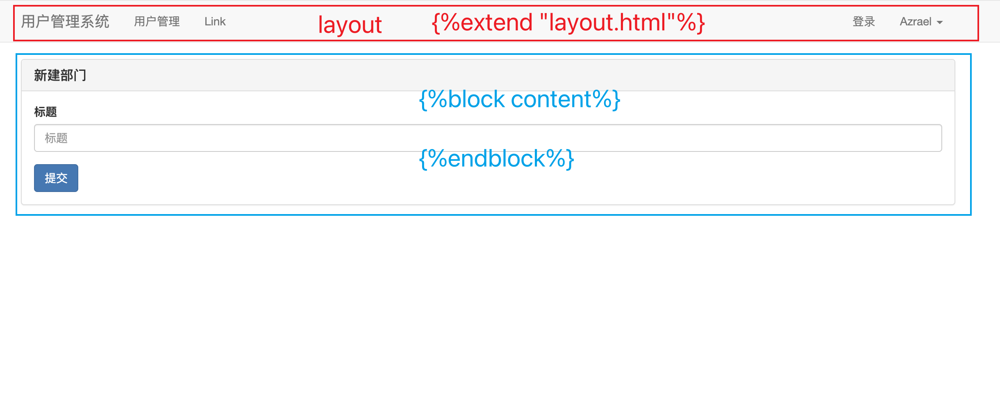
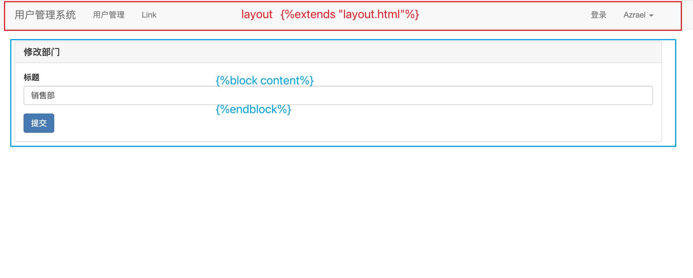

# Learn-Django

#### Django3 学习记录


| [安装Django](#install_django) | [Form](#form)                   | [URL传值](#url_val)                 |                                          |
| ----------------------------- | ------------------------------- | ----------------------------------- | ---------------------------------------- |
| [创建项目](#start_app)        | [ModelForm](#model_form)        | [模版继承](#template_extends)       | [URL与函数的对应关系](#url_view)         |
| [启动App](#run_app)           | [请求和响应](#request_response) | [模版语法](#mvt)                    | [Django链接MySQL](#django_mysql)         |
| [Ajax请求](#ajax)             | [Cookie 与 Session](#session)   | [Django操作表](#django_models)      | [Django中间件实现鉴权](#middleware_auth) |
| [静态文件](#static)           | [form表单提交报错](#csrf_token) | [Django 操作表中数据](#django_view) |                                          |

> <span id="install_django">安装 Django</span>

```shell
pip3 install django==version
```

> 创建项目

```shell
django-admin startproject projectname
```

> 默认文件介绍

```shell
mysite
├── manage.py       //项目管理、启动项目、创建app、数据管理(---经常使用---)
└── mysite
    ├── __init__.py
    ├── asgi.py     //接收网络请求(不需要改)
    ├── settings.py //项目配置(---经常修改---)
    ├── urls.py     //url和函数的对应关系(---经常修改---)
    └── wsgi.py     //接收网络请求(不需要改)
```

> App

```
- 项目
    - app，用户管理
    - app，网站
    - app API
    //每个app互不影响
    //一般一个项目就创建一个app
```

> <span id="start_app">创建 App</span>

```shell
python3 manage.py startapp app
```http://127.0.0.1:8000/upload/form/
```

> App 项目结构

```
app
├── **init**.py
├── admin.py //固定不用动,Django 默认提供的 admin 后台管理
├── apps.py //固定不用动,app 启动类
├── migrations //固定不用动,数据库变更记录
│ └── **init**.py
├── models.py //对数据库进行操作(重要)
├── tests.py //固定不用动,单元测试
└── views.py //函数(重要)
```

> <span id="run_app">启动 App</span>

注册 app 在 setting.py 中的 INSTALLED_APPS 中添加 app.apps.AppConfig [setting.py]


编写 URL 和视图函数的对应关系 [urls.py]


编写视图函数 [views.py]


启动 Django 项目

```shell
python3 manage.py runserver   然后访问http://127.0.0.1:8000/index
```

> <span id="url_view">URL 与函数的对应关系)</span>

```
url->函数->执行函数
```


> templates 模版


> <span id="static">静态文件</span>

**开发过程中一般将**:

- 图片
- css
- js

**都视为静态文件存放在/app/static/下**


**再app中创建static文件夹**



> 引用静态文件


> <span id="mvt">模版语法(MVT)</span>

_本质上:在 HTML 中写一些占位符,由数据对这些占位符进行替换和处理_


> <span id="request_response">请求和响应(api)</span>


redirect 重定向工作方式如下(Django 返回一个值后,浏览器再去向这个页面发起请求)


> <span id="csrf_token">form 表单提交报错</span>


解决办法(在 form 表单内部添加  )


> Django ORM 模型


> ORM的作用

创建、修改、删除数据库中的表(不用写 SQL 语句);[无法创建数据库] 操作表中的数据(不用写 SQL 语句)

> <span id="django_mysql">Django 连接数据库MySQL</span>

在 setting.py 中进行配置和修改

```python
DATABASES = {
    'default': {
        'ENGINE': 'django.db.backends.mysql',
        'NAME': 'homework',  #databasesname
        'USER': 'root',  #username
        'PASSWORD': 'yznaisy993279..',  #password
        'HOST': 'localhost',
        'PORT': '3306',
    }
}

# 安装第三方模块
pip3 install mysqlclient
```

> <span id="django_models">Django 操作表(在 models.py 中)</span>

- 创建表

```python
from django.db import models

class UserInfo(models.Model):
    name = models.CharField(max_length=32)
    password = models.CharField(max_length=64)
    age = models.IntegerField()
    # 当其他表与此表有关联时的返回值 若不设置返回值则 默认是一个对象
    def __str__(self):
        return self.name

"""
上述代码等同于
create table app_classname[小写的类名](
    id bigint auto_increment primary key,   此行为自动生成
    name varchar(32),
    password varchar(64),
    age int
)
"""

# 在此之前app必须注册
# setting.py  INSTALLED_APPS中添加 如下代码:
# 'app.apps.AppConfig'  
#app下apps.py中的appConfig(第一个class)

# default 默认值(视情况而定)
# verbose_name 别名(string)
# max_length 最大长度(int)
models.CharField(verbose_name="姓名", max_length=16)
models.IntegerField(verbose_name="年龄")

# max_digits 数字的位数(int)  
# decimal_places 小数点后显示多少位(int)
models.DecimalField(verbose_name="账户余额", max_digits=10, decimal_places=2, default=0)
models.DateTimeField(verbose_name="入职时间")

# to  表示与那张表又关联
# to_fied   关联表中的那一列
# on_delete=models.CASCADE   级联删除  当部门被删除时用户也被删除
# 获取数据库中的值时  obj.字段名返回值所关联的表返回的值  obj.字段名_id为关联表中对应的id
models.ForeignKey(verbose_name="部门",
                  to="Department",to_field="id",on_delete=models.CASCADE)

python3 manage.py makemigrations  # 检查是否更改


# 数据库存储数字
# 使用 get_字段名_display 得到对应的值
gender_choices = ((1, "男"), (2, "女"))
models.SmallIntegerField(verbose_name="性别",choices=gender_choices)

### 配置MEDIA ###
# setting.py中添加如下两行
MEDIA_URL = "/media/"
MEDIA_ROOT = os.path.join(BASE_DIR, "media")

# urls.py中
urlpatterns = [
    re_path(r"^media/(?P<path>.*)$",serve, {'document_root': settings.MEDIA_ROOT},
             name="media"),   # name为文件夹名称(与setting.py中一致)
]
# upload_to  media下的目录名称  再此之前需要配置 MEDIA
models.FileField(verbose_name="Logo",max_length=128,upload_to='city/')  


python3 manage.py migrate         # 应用更改
```

- 删除表

删除相应的 class 再执行上述命令`makemigrations`与`migrate`

- 修改表

在表中新增列时,由于已存在的的列中可能已有数据，所以新增的列必须要指定数据

- 手动添加


- 允许为空

```python
# 设置默认值
size = models.IntegerField(default=5)
# 允许为空
data = models.IntegerField(null=True,blank=True)
```

> <span id="django_view">Django 操作表中的数据</span>

```python
from app.models import UserInfo,Deparment
def orm(request):
        #测试ORM操作表中的数据
        ### 新建 ###
        objects.create(title="销售部")

        objects.create(name="Azrael",password="123",age=19)

        object = UserInfo(name="test",password="123",age=22)
        object.save()

        ### 删除 ###
        objects.filter(age=2).delete() # 删除age=2的数据
        objects.all().delete() # 删除所有数据

        ### 获取数据 ###
        # Querset = [obj,obj,obj]    一个列表中有多个对象
        QuerySet =  objects.all() # 获取当前表的所有数据

        objects.exclude(id) # 排除符合要求的数据
        objects.filter(age=29) # 过滤符合条件的数据(可以有多个条件)

        row_obj=objects.filter(age=29).first() # 获取到第一个对象
        print(row_obj.id,row_obj.name) # 对象.字段名即可获取数据

                objects.filter(username__contains="admin")  # 查询username中是否包含admin

        data_dict = {"age":2}
        objects.filter(**data_dict) # 也可以使用字典进行过滤

        objects.all().order_by("-id")  # 按照id来排序,默认升序,在字段名前加"-"为降序

        objects.filter(id=uid).exists() # 是否有符合要求的数据返回值为  布尔类型 

        # values与values_list中字段为数据库中的字段
        objects.all().values("id","title","price","status") # 列表中套字典
        objects.all().values_list("id","title","price","status") # 列表中套元组

        ### 更新数据 ###
        objects.all().update(password=999)
        objects.filter(age=19).update(password=666)
```

> <span id="url_val">URL 传值</span>

- 匹配

```python
/depart/<int:nid>/edit/
```

- ?

```python
/depart/edit/?nid=int&name=str
```

> <span id="template_extends">模版继承</span>

```django
 # 模版
      

 <div>
          # 相当于占位符
 </div>

       
```

```django
 # 继承模版

      #必须先继承

 
     <link
       rel="stylesheet"
       href=""
     />
 <style>
     ....
 </style>
 

 
 <h1>首页</h1>         # 替换占位符
 


 
 <script src=""></script>
 <script>
     ...
 </script>
 
```











> <span id="form">FORM 组件</span>

form.py

```python
from django import forms
class MyForm(forms.Form):
  ### 设置需要的字段以及类型 ###

    # name = forms.CharField() 为存储在数据库时的类型

    # widget=forms.TextInput 为Django渲染的输入框类型包括以下类型
    # TextInput,PasswordInput,
    name = forms.CharField(
        label="用户名",  #  别名
        widget=forms.TextInput(attrs={
            "class": "form-control",
            "placeholder": "用户名"
        }),
        required=True  # 必填项  不能为空
    )
    password=forms.CharField(
        label="密码",
        widget=forms.PasswordInput(attrs={
            "class": "form-control",
            "placeholder": "密码"
        },
                render_value=True  # 不清空输入框内容
        ),
        required=True,  # 必填项  不能为空
    )
    code=forms.CharField(label="验证码", widget=forms.TextInput, required=True)
    # disabled=True 此字段不允许修改
    mobile = forms.CharField(disabled=True,label="手机号")
    # 钩子函数
    # 函数名称clean_fieldname(fieldname为fields的名称)
    def clean_password(self):
        pwd = self.cleaned_data.get("password")
        return md5(pwd)
```

views.py

```python
from ...from import MyForm
from app import models
def from_add(request):
  	
    if request.method == "GET":
      	# 只做渲染
        # 实例化Form
        form = MyForm()
        return render(request, 'template.html',{"form":form})
    # data=request.POST 获取提交的数据 
    form = MyForm(data=request.POST)
    if form.is_valid():
      # 提交的数据
      print(form.cleaned_data)
      # Form没有  form.save()方法   因为ModelFrom是关联数据库的而Form没有
      
      # 验证\保存到数据库\保存文件等逻辑得手写
      # 验证字段  定义表单错误
      form.add_error("password", "密码或用户名错误
      return render(request, "template.html", {"form": form})
      ...
```

template.html

```django
手动渲染
<form method="post">
  {{ form.field_name_1 }}
  {{ form.field_name_2 }}
  {{ form.field_name_3 }}
</form>


循环渲染

<form method="post">
    
        {{ field }}
    
</form>
```

> <span id="model_form">ModelForm 组件(针对数据库中的某个表)</span>

models.py

```python
from django.db import models

class UserInfo(models.Model):
    """ 员工表 """
    name = models.CharField(verbose_name="姓名", max_length=16)
    password = models.CharField(verbose_name="密码", max_length=64)
    age = models.IntegerField(verbose_name="年龄")
    account = models.DecimalField(verbose_name="账户余额", max_digits=10, decimal_places=2, default=0)
    create_time = models.DateTimeField(verbose_name="入职时间")
    depart = models.ForeignKey(to="Department", to_field="id", on_delete=models.CASCADE)
    gender_choices = (
        (1, "男"),
        (2, "女"),
    )
    gender = models.SmallIntegerField(verbose_name="性别", choices=gender_choices)
    mobile = models.CharField(verbose_name="手机号", max_length=32)
```

ModelForm.py

```python
from django import forms
from app import models

class MyModelForm(forms.ModelForm):
      # 自定义字段
    # 此处语法与form一致
    xx = form.CharField*("...")
    class Meta:
          # 对应的数据库
        model = models.UserInfo
        # 需要渲染的字段   可以是数据库或者自定义的
        fields = ["name","password","age",'mobile',"xx"]
        # fields ="__all__"  #所有字段
        # exclude  = ['level']   #排除某个字段
        # 插件
        widgets = {
            # render_value=True 不会清空输入框
          	# "fiedlname":...
            "password": forms.PasswordInput(render_value=True)
        }

    # 钩子函数
    # 函数名称clean_fieldname(fieldname为fields的名称)

    def clean_password(self):
      # cleaned_data为用户发送来的数据
      pwd = self.cleaned_data.get("password")
      # 数据库存储的为钩子函数的返回值
      return md5(pwd)  # return 返回的是保存到数据库中的值
    def clean_mobile(self):
      text_mobile = self.cleaned_data["mobile"]
      # self.instance wei 当前数据库中的值
      exists = models.PrettyNumber.objects.exclude(
        id=self.instance.pk).filter(
        mobile=text_mobile)  
      # print('number', self.instance.mobile)
      # print('price', self.instance.price)
      # print('level', self.instance.level)
      # print('status', self.instance.status)
      # print('id', self.instance.id)
      # print('pk', self.instance.pk)
      if exists:
        raise ValidationError("手机号已存在")
        return text_mobile
      

```

views.py

```python
from ...from import MyModelForm

def mode_form_add(request):
    if request.method == "GET":
      	# instance=row_obj 在页面上显示当前数据库中的数据
        form = MyModelForm(instance=row_obj)
        return render(request, 'template.html',{"form":form})
      
    # data=request.POST 获取提交的数据 
    row_obj = models.UserInfo.objects.filter(id=nid).first()
    # 每个 ModelForm 也有 save() 方法。此方法根据绑定到表单的数据创建并保存数据库对象。
    # ModelForm 的子类可接受一个现有的模型实例作为关键字参数 instance ；
    # 如果提供了，则 save() 会更新这个实例。如果没有，则 save() 会创建一个对应模型的新实例
    # 在编辑数据时记得添加
    form = MyForm(data=request.POST,instance=row_obj)
    if form.is_valid():
      # 提交的数据
      print(form.cleaned_data)
      
      
      # modelform在保存之前插入非用户提交的数据(或更改提交的数据)
      # form.instance.字段名 =  "xxxxxx"
      # 插入订单号
      form.instance.oid = datetime.now().strftime("%Y%m%d%H%M%S") + str(random.randint(1000, 9999))
      # modelform可以直接保存
      form.svae()
      
      # 验证\保存到数据库\保存文件等逻辑得手写
      # 验证字段  定义表单错误
      form.add_error("password", "密码或用户名错误
      return render(request, "template.html", {"form": form})
```

template.html

```django
手动渲染
<form method="post">
    {{ form.user }}
    {{ form.pwd }}
    {{ form.email }}
    <!-- <input type="text"  placeholder="姓名" name="user" /> -->
</form>


循环渲染

<form method="post">
    
        {{ field }}
    
    <!-- <input type="text"  placeholder="姓名" name="user" /> -->
</form>
```

ModeForm 定义插件

```python
class MyModelFormPlugin(forms.ModelForm):
    name = forms.CharField(
        min_length=3,
        label="用户名",
        widget=forms.TextInput(attrs={"class": "form-control"})
    )

    class Meta:
        model = models.UserInfo
        fields = ["name", "password", "age"]
```

批量定义插件

```python
class MyModelFormPlugins(forms.ModelForm):
    class Meta:
        model = models.UserInfo
        fields = ["name", "password", "age",]

    def __init__(self, *args, **kwargs):
        super().__init__(*args, **kwargs)

        # 循环ModelForm中的所有字段，给每个字段的插件设置
        for name, field in self.fields.items():
            # 字段中有属性，保留原来的属性，没有属性，才增加。
            if field.widget.attrs:
                field.widget.attrs["class"] = "form-control"
                field.widget.attrs["placeholder"] = field.label
            else:
                field.widget.attrs = {
                    "class": "form-control",
                    "placeholder": field.label
                }
```

自定义类

```python
class BootStrapModelForm(forms.ModelForm):
    def __init__(self, *args, **kwargs):
        super().__init__(*args, **kwargs)
        # 循环ModelForm中的所有字段，给每个字段的插件设置
        for name, field in self.fields.items():
            # 字段中有属性，保留原来的属性，没有属性，才增加。
            if field.widget.attrs:
                field.widget.attrs["class"] = "form-control"
                field.widget.attrs["placeholder"] = field.label
            else:
                field.widget.attrs = {
                    "class": "form-control",
                    "placeholder": field.label
                }
```

继承使用

```python
class UserEditModelForm(BootStrapModelForm):
    class Meta:
        model = models.UserInfo
        fields = ["name", "password", "age",]
```

> <span id="session">Cookie 与 Session</span>

- cookie:随机字符串
- session:用户信息

```python
# 设置session
request.session["info"] = {"id":object.id,"name":object.name}

# 设置session失效时间  单位为秒
request.session.set_expiry(60)

# 获取session
info = reuqest.session.get("info")
```

> 使用 cookie 与 session 实现免密码登录

```python
# 登录时生成cookie与session
def login(request):
  ...
  request.session["info"] = {"id":object.id,"name":object.name}
  ...

# 验证是否已经登录
# 在视图函数前统一加入判断
info = request.session.get("info")
if not info:
  return redirect("/login/")
...
```

> <span id="middleware_auth">Django中间件实现鉴权</span>

- 定义中间件

```python
from django.utils.deprecation import MiddlewareMixin
# 定义中间件
class M1(MiddlewareMixin):
    """ 中间件1 """
        # 请求时触发的函数  (函数名不能改)
    # 如果方法中没有返回值（返回None），继续向后走
        # 如果有返回值 HttpResponse、render 、redirect，则不再继续向后执行。
    def process_request(self, request):

        # 如果方法中没有返回值（返回None），继续向后走
        # 如果有返回值 HttpResponse、render 、redirect
        print("M1.process_request")
        return HttpResponse("无权访问")
        # 响应时触发的函数  (函数名不能改)
    def process_response(self, request, response):
        print("M1.process_response")
        return response

# 实现登录校验

class AuthLoginMiddleware(MiddlewareMixin):
  def process_request(self, request):
        # 排除那些不需要登录就能访问的页面
        # request.path_info 获取当前用户请求的URL /login/
        if request.path_info in ["/login/","/image/code/","/task/ajax/"]:
            return

        # 读取当前访问的用户的session信息，如果能读到，说明已登陆过，就可以继续向后走。
        info_dict = request.session.get("info")
        print(info_dict)
        if info_dict:
            return

        # 2.没有登录过，重新回到登录页面
        return redirect('/login/')
```

- 注册中间件

```python
MIDDLEWARE = [
    'app.middleware.auth.AuthMiddleware',
]
```

> <span id="ajax">Ajax 请求</span>

- Django

```python
import json
from django.http import JsonResponse
from django.views.decorators.csrf import csrf_exempt


@csrf_exempt   # 免除csrf_token认证
def task_ajax(request):
    data_dict = {"status": True, 'data': [11, 22, 33, 44]}
    # 返回JSON数据 (方式一)
    return HttpResponse(json.dumps(data_dict))
      # 返回JSON数据 (方式二)
    return JsonResponse(data_dict)
```

- JavaScript

```JavaScript
$(function () {
            // 页面框架加载完成之后代码自动执行
            bindBtnEvent();

        })

        function bindBtnEvent() {
            $("#btn1").click(function () {
                $.ajax({
                    url: '/task/ajax/', // 请求的api
                    type: "post",       // 请求类型
                    data: {             // 请求数据
                        n1: 123,
                        n2: 456
                    },
                    dataType: "JSON",   // 设置返回的数据类型 (自动序列化)
                    success: function (res) {
                        console.log(res);
                    }
                })
            })
        }
```
